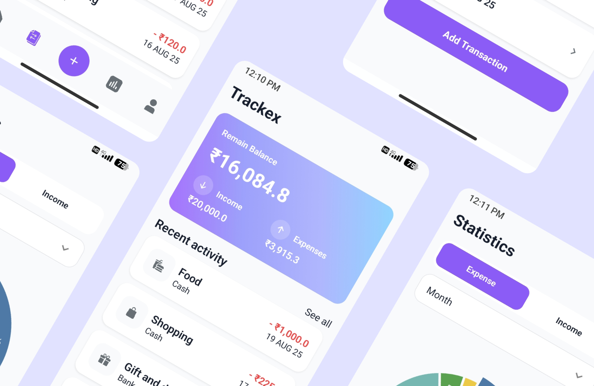

# 📊 Trackex

**Trackex** is a full-featured **expense tracking mobile app** that helps users manage their daily **expenses and incomes**. It provides a clean interface to record, categorize, and analyze financial activities, making it easier to stay on top of personal budgeting.

---

## ✨ Features

- 📌 Add, edit, and delete **income & expense entries**
- 📂 Categorize transactions (e.g., Food, Travel, Bills, Salary, etc.)
- 📊 Track daily, weekly, and monthly spending patterns
- 🔐 Secure **data storage**
- 🌙 Modern and responsive UI with support for smooth gestures & bottom sheets
- ☁️ **Use SQLITE** for persistent data storage

---

## 🛠️ Tech Stack

- **React Native** (with **Expo**)
- **UI Libraries**: Bottom Sheet, Gesture Handler, etc.
- **EXPO SQLITE**: Store data on mobile device with the use of expo-sqlite

---

## 🚀 Getting Started

### Prerequisites

- Node.js (>= 20)
- Expo CLI

### Clone the repo

```bash
git clone https://github.com/abhaychauhan8802/trackex.git
cd trackex
npm install
npm start
```
